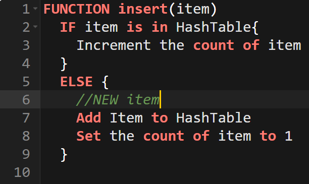
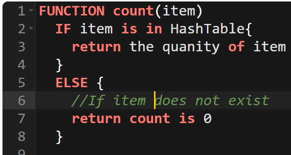

## Introduction
My design models a player inventory system that uses a HashTable<string, int>. I have chosen this data structure to model my game system because a HashTable is able to store an item(string) and also keep count(int) of how many of this item we have in our inventory. The reason this is the best data structure to use is because of the ability to store the number(count) of a certain item that we have. Using a HashTable for our game system will be helpful because knowing the quantity of an item is extremely important.  
## Design Philosophy
### Efficiency  
For my MultiSet implementation, I wanted to prioritize speed in my design. Speed is a huge focus of all modern games; players want to be able to play a game that runs smoothly and gives seemingly instantaneous feedback. This is demonstrated by McCoy and Pandey, who note that HashTables are being used to accelerate data processing(McCoy & Pandey, 2025). For this exact reason, this is the main reasoning behind why the HashTable is an efficient choice for a multiSet implementation. Most operations of the HashTable are constant time (*Std::unordered\_map \- Cppreference.com*, 2025), which is perfect for what I want to achieve speed-wise for the game. Also, I can add more instances of an element without allocating extra memory for duplicates.  
### Simplicity
Our Hash Table exemplifies simplicity; we are able to use the string to store the name of the item, then use the int stored in it to represent how many occurrences/instances we have of that specific item. This data structure is also very intuitive in how it works; the client can easily see the intention of storing the object name as a string, and then using the int to keep track of the number of occurrences for that element.  
### Extensibility  
The Hash Table is easily extensible. This is perfect for games in this age, as they are constantly adding features to their architecture. The core operations of the HashTable allow us to add a multitude of things, such as merging inventories, managing player stats, or even managing card games.  
### Readability
HashTables are great for readability. The use of our key-value pairs is evident that the key is the name of the item, and the value is the number of that item. Other operations, like the insert or remove function, further demonstrate this readability and simplicity.  
## Core Operations
Every MultiSet should have 4 essential operations: an *insert* function, a *remove* function, a *count* function, and a *contains* function

**Client**: Game developers  
**User**: Consumers of products put forth by developers.

`Insert Function:`

* **What it does conceptually in your chosen game scenario:**

In my chosen game scenario, the insert function is responsible for adding items(key) into our player's inventory. In addition to adding the item(key), the insert function must also add the number of instances. This function can be used to accumulate items that may already be in the table, and update the value to indicate how many of the items the player has in the inventory.  
* **Its expected time complexity:**  
	
The insert function has O(1) average time. This function simply inserts the key if it is not in the MultiSet; if it is, then it will increment the value.  
****  
**Figure 1**  
* **Possible edge cases or exceptional situations:**

	- Inserting a key with an empty name

* **How your underlying data structure supports or constrains the operation:**  
	The HashTable data structure supports this operation well. The structure of a HashTable using key-value pairs is perfect for what I want to achieve. If a key does not yet exist, the operation simply inserts the key with a value of 1\. If the key does exist, the value is incremented. We are able to have direct access, skipping the need to look through all the keys, which can make our insertion near instantaneous.

`Remove Function:`

*  **What it does conceptually in your chosen game scenario:** 

In the selected game scenario, the remove function will decrement the value if the item already exists in the table. Further, if there is more than one of the item, the function will remove one of the items from the value. If no more of the item exists, or more simply put, if the value is 0, the item will be removed from the inventory. For example, if a player shoots arrows, every time an arrow is fired, the player must lose an arrow from their inventory, and if they run out of arrows, the item must disappear from the inventory   
* **It’s expected time complexity:**  
	- This function is expected to have O(1) average time complexity.  
* **Possible edge cases or exceptional situations:**

	- Count is already 0, in this case, we do not want the player to have negative items. The player should simply run out, so no removal should be performed.  
	- Removing more than the player has. Similar to the last case, we do not want the player to have negative items; therefore, no removal will be performed due to insufficient funds, so to speak.  
	- Removal of an item that does not exist. A player should not lose an item they do not have in their inventory

 * **How your underlying data structure supports or constrains the operation:**  
	The use of a HashTable supports this operation because of quick access checking, the value can easily be retrieved and either decremented if it is greater than zero otherwise, if it is equal to zero, the key can be deleted, which helps free up memory after the item is completely gone.  
   
`Count Function:`

* **What it does conceptually in your chosen game scenario:** 
The count function will provide the user with how many occurrences they have of a certain item. This function is important because it can be used for crafting purposes. If a player does not have enough of an item, they are not able to craft another item.  

* **Its expected time complexity:**  
		Simply O(1) time. This function is just retrieving the value stored with the associated key.  
 

**Figure 2**

* **Possible edge cases or exceptional situations:**  

\- Getting the value associated with a key that does not exist. In this case, just return zero.

* **How your underlying data structure supports or constrains the operation:** 

The HashTable supports this operation because of its key-value setup. Since we are storing the count in the value, we can return, value as how many we have. The HashTable also makes this extremely efficient because the value is already stored. If a LinkedList were to be used, each element would have to be checked. If an AVL tree were used, duplicates would lead to a very complicated process. The HashTable is by far the best for the count function.

`Contains function:` 

* **\-What it does conceptually in your chosen game scenario:**   
		In my game scenario, the contains function will be used to see if an element exists in the player's inventory. This function can allow a player to use a door if they have a key in their inventory, or even craft items if they have the required items in their inventory  

* **Its expected time complexity:**  
		Expected time complexity is O(1). This function just checks if the key exists or not.  

* **Possible edge cases or exceptional situations:** N/A  

* **How your underlying data structure supports or constrains the operation:**  
	   A HashTable supports this operation well, since this operation only cares if the key exists, so we are just checking for that. This function is also extremely quick and efficient.  
	  
## **Set Operations**  
Two set operations that are meaningful in my game are *union\_with()* and *intersection\_with().*

`union\_with():`

* **What it accomplishes in gameplay:**

	The union function will be pivotal in joining the player's inventory with any other instance when the player obtains loot or new items. The union operation is very important for the game because it is heavily focused on obtaining loot from a multitude of situations that could range from other players, enemies, or chests. Another application of this function is that the player could have items across multiple chests, so the total count of the items in all chests is be able to be shown.

* **How it manipulates your data structure :**  
	This operation manipulates the data structure by iterating through each key-value pair. The operation then checks if the element is in the current MultiSet, if it is not the key-value pair is inserted with the count obtained from the other MultiSet. If the element is there, the operation adds the counts together to obtain the total count.  
	  
* **Its conceptual complexity and any relevant edge cases**   
	**Conceptual:**   
		The union function is straightforward. This operation acts as a way to add the counts of items together in almost every case. For example, if there is 1 arrow in a MultiSet and 2 in another, there are 3 total arrows. This is the logic behind the operation.  
	**Edge Cases:**  
		Empty Sets. Empty Sets will be treated as if there is nothing.  

`inersection\_with():`

* **What it accomplishes in gameplay** 

	The intersection operation can be used for checking if a player has the needed materials in their inventory to craft an item. If the items are not shared, the player will be blocked from crafting the item. This operation can also be used for determining if a player has the required items to complete a quest.  

 * **How it manipulates your data structure** 

 This operation manipulates the data structure by iterating through the HashTables looking for the element in each table. If the element exists in each table, then allow the player to perform the necessary action. If the element does not exist in each table, do not allow the player to perform the action.

* **Its conceptual complexity and any relevant edge cases**   
	**Conceptual complexity:**  
		Conceptually, it is clear that this operation is looking for shared elements among both HashTables. The logic required for this is also clear: iterate through and make sure the player has all of the needed items.  
	**Edge cases:**  
		\-Shared element is empty. If the MultiSet we are checking is empty, this may cause an error. This should be handled as if there were no requirements.  
		\- Inventory and Shared Set are empty. This should always fail because there is nothing to truly craft.  
## **Extension Feature**  
	The extension feature I chose for my game is craftRecipe(). Crafting is an essential part of games with inventories; being able to use items to craft something forces players to make strategic decisions about what they are willing to sacrifice, and about what they are not willing to. I chose this function to be an extension because it is a great representation of progression for the player.  
**New Method: craftRecipe(recipe, result)**  
	This method takes in the ingredients as the recipe; if the requirements for the recipe are met, then the item(result) can be crafted. This method must be able to check if the valid ingredients are present, decrement ingredients from the player's inventory, and increment or add the result to the player's inventory  

	This method will depend on other existing operations in our MultiSet, though. The contains function will be used to see if the player has the items in their inventory that are necessary to craft the item. Another operation that will be used is the count operation. This operation will be used to check if the player has enough of each item. The removal operation will ensure that ingredients are consumed after the player crafts an item. The add operation will be used to add the crafted item to the inventory.

## **UML Diagram/ Abstraction Boundary**  
****  
**Figure 3**

* **Hidden Data/Operations:** 

**The HashTable data structure is hidden from the user for a few reasons.** 

	* It is not important for the user to know what data structure is being used. Having the user understand the operations is more valuable the understanding the data structure  
	* The user knowing the data structure may allow the user to be intentional in breaking the game. There are many situations of the data structure that rely on the best-case performance. The user can intentionally cause collisions.  
	* If a user understands what structure is used, this may enable the user to easily modify elements in the table.

**The helper methods must be hidden because:**

	* If the consumeIngredients method were visible to the user, the user would be able to use it without having checked if the needed items are present  
	* These helpers are not relevant to the user; the user is simply focused on whether they are able to craft the item or not. Hiding these methods endorses simplicity for the user.

## **Trade-Off Analysis**  

The HashTable was my choice over the Sequence data structure for a few reasons. Mainly, I wanted to prioritize speed in my design. The HashTable provides O(1) average time for my essential operations(add, remove, count, contains) of the game. As a Sequence grows in size, the O(N) is simply not viable for the speed of the game. For example, if a player wants to check how many apples they have, the whole sequence must be traversed to determine the total amount of apples. Also, the Sequence data structure does not store unique duplicates, every insertion is able to be put in the Sequence. This is inefficient and a waste of memory.

|  | HashTable | Sequence |
| :---- | :---- | :---- |
| add | O(1) average case | O(1) |
| remove | O(1) average case | O(N) |
| count | O(1) average case | O(n) |
| contains | O(1) average case | O(n) |
| Disadvantages  | Worst Case is O(n) No Guranteed Order | Slow traversal because of O(N) time. Inefficient for memory |
| Advantages | Good for memory Reduced Search Time Scales well for inventory | Easier to understand Sequential Order Good for ordered data |

## **Alternative Design Sketch**  
	If I had chosen to use the Sequence data structure for my design, the main difference would be the storage. For the HashTable, I am using { “arrow”, 2} to show that the player has 2 arrows in their inventory. For the Sequence, the data could be stored like this \[ “arrow”, “x”, “arrow”, “x”\].

**How it would differ:**

| Operation | Modifactions  |
| :---- | ----- |
| **add**  | The inserted element would need to be appended to the end of the list |
| **remove** | Linear search O(N) to find an element and delete it. |
| **count** | Traverse(Linear Search) the entire list to find every occurrence and increment it |
| **contains** | Linear search through the list to check if the sequence contains it. |
| **craftRecipe** | Use a linear search multiple times to verify each ingredient. |

## **Evaluation Plan**  
	If I were to test this design, if implemented, this is the path I would follow these tests.

`Add:`

* Check that a new MultiSet is created for unique elements  
* Check that duplicates are incremented

`Remove:`

* Verify count decrements when an element is removed  
* Verify MultiSet is deleted when count is 1

`Count:`

* Check count is displaying the quantity of element.  
* Check that non-existent element, returns 0

`contains:` 

* If the count is greater than zero, return true  
* If the count is less than 0(does not exist), return false

`Union\_with:`

* Check that elements from the two sets being joined are added to a new set

`Intersection\_with:`

* Check that this operation only returns true when elements are present in both sets.

`Extensibility:`

* How many lines needed for a new operation?  
* New operations don’t break existing operations  
* New operations don’t require heavy changes to existing operations

`Maintainability:`

* Is HashTable resized when it grows too large?  
* What time complexity are we getting on operations?  
* How are collisions handled?

## **Conclusion/Reflection**  
The design of this MultiSet implementation is strong and effective because of its speed and simplicity. The O(1) average time is perfect for a game inventory system, providing quick responses. The Key-Value structure used is great for modeling items and their count, which in turn is effective for our memory.  
The few trade-offs sacrificed for the use of our data structure were minimal compared to my goals for this project. The non-guaranteed ordering & O(n) worst-case time complexity in worst-case situations were outweighed by memory efficiency and reduced average-time complexity, among other things. With more time, I would update my operations to perform bulk tasks like removing or adding multiple elements at once. I would also update intersection\_with specifically to be able to see checks for shared items. Upon reflecting, I see how that could provide importance to a game.  
Abstraction was shown through design choices for this implementation. The operations focus on the intended actions, and the data structure in use was hidden from the user. Doing this allows the user not to worry about the more complex implementation details. Encapsulation was shown through hidden helper methods that protected illegal state changes. The count was also protected from ever becoming negative by enforcing controlled access through the public interface, which ensures data integrity. Composition was shown through the craftRecipe() operation. This operation relied on the use of other core operations to simplify logic for the craftRecipe() operation. These three key programming principles were shown through decisions to create simple operations that are easier to understand, the protection of data from being manipulated, and the ability to use core operations to create more complex ones.

**References**  
McCoy, H., & Pandey, P. (2025, September 19). *WarpSpeed: A High-Performance Library for Concurrent GPU Hash Tables*. arxiv. https://arxiv.org/abs/2509.16407  
*std::unordered\_map \- cppreference.com*. (2025, April 26). C++ Reference. Retrieved December 7, 2025, from https://en.cppreference.com/w/cpp/container/unordered\_map.html  

